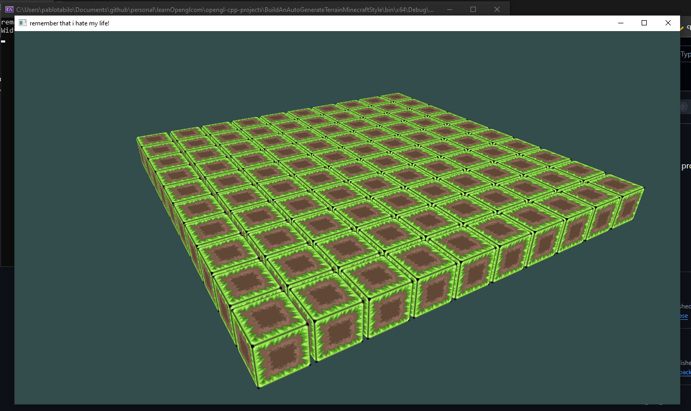

# Opengl with CPP projects
Build differents games and simulations

## Project 1
This is for learning purpose

## Build an AutoGenerate Terrain Minecraft Style
### Only plot boxes

### Diamond-Square Algorithm

References for learn about this algorithm:
* https://www.lighthouse3d.com/opengl/terrain/index.php?mpd2
* https://en.wikipedia.org/wiki/Diamond-square_algorithm
* https://medium.com/@f.scaramelli0/heightmap-generation-using-the-diamond-square-algorithm-part-1-7c558aff7525